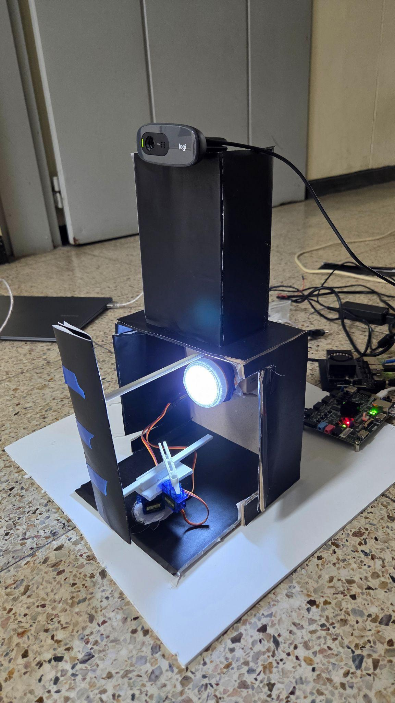
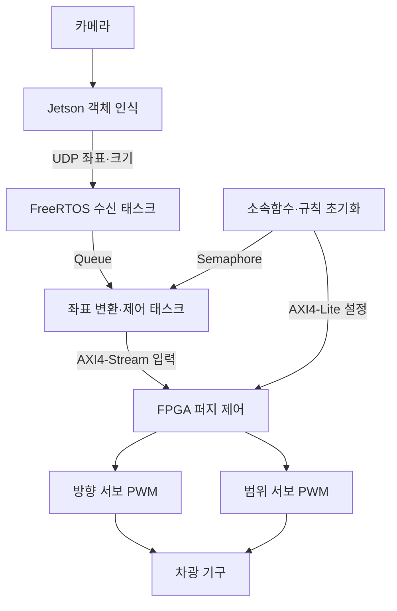
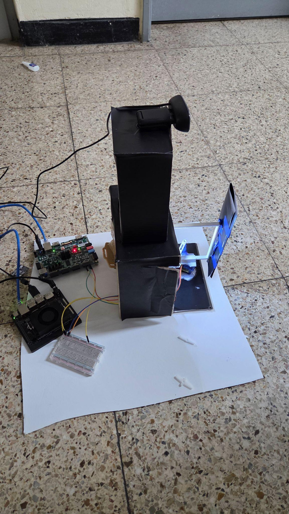

# Adaptive Driving Beam System

**Jetson 객체 인식과 Zynq FPGA 퍼지 제어를 결합한 능동형 전조등 프로토타입**

2025년 4분기

카메라로 인식한 전방 객체의 위치와 크기에 맞춰 차광막의 방향과 범위를 조절합니다. Jetson Orin Nano가 영상 인식을 맡고, Zybo Z7-20의 ARM 프로세서와 FPGA가 데이터 전처리·퍼지 연산·서보 제어를 분담합니다.

영상 처리부터 이더넷 통신, RTOS 태스크, 하드웨어 연산 파이프라인, 기구부까지 연결해 실내 추적·차광 동작을 시연했습니다.

[시연 영상](media/adb-demo.mp4) · [설계 설명](docs/architecture.md) · [구현 결과](docs/results.md)

## 시스템 구성

| 구간 | 구성 | 역할 |
|---|---|---|
| 영상 입력 | Logitech C270 | 전방 영상 획득 |
| 객체 인식 | Jetson Orin Nano, YOLOv7, TensorRT | 객체 검출, 제어 대상 선택, 좌표·면적 정규화 |
| 통신 | Ethernet, UDP | `x_left x_right size` 전송 |
| PS 소프트웨어 | Zynq Cortex-A9, FreeRTOS, lwIP | 수신·계산 태스크 분리, 좌표 변환, PL 설정·데이터 전달 |
| PL 하드웨어 | Verilog, AXI4-Lite, AXI4-Stream | 입력 안정화, 소속도 계산, 규칙 평가, 역퍼지화 |
| 차광 기구 | SG90 서보 2개, 3D 프린팅 구조물 | 차광 방향 회전, 슬라이더-크랭크 방식의 차광 범위 조절 |

## 구현의 핵심

### 영상 인식과 제어의 역할 분담

Jetson에서 객체를 검출한 뒤 가장 큰 대상의 좌우 좌표와 면적 비율을 전송합니다. PS에서는 좌표를 카메라 화각에 대응하는 각도로 바꾸고, PL 입력 범위에 맞게 정수로 정규화합니다. 영상 추론과 모터 제어를 서로 다른 연산 장치에 배치했습니다.

### FreeRTOS 기반 데이터 흐름

UDP 수신 태스크와 제어 태스크를 Queue로 연결했습니다. PL의 소속함수·규칙 설정을 완료하면 Binary Semaphore로 제어 태스크를 시작합니다. AXI DMA 전송에는 정렬된 버퍼와 캐시 flush를 사용하며, 200ms 동안 새 입력이 없으면 영점 입력을 전달합니다.

### FPGA 퍼지 연산 파이프라인

사다리꼴 소속함수, Min-Max 규칙 평가, Singleton 역퍼지화를 파이프라인으로 처리합니다. 소속함수의 기울기는 PS에서 미리 계산하고, PL에서는 곱셈과 시프트로 처리합니다. 규칙 집계와 역퍼지화에는 Max Tree와 Adder Tree를 사용했습니다. 입력 안정화용 필터 모듈도 별도로 제공합니다.

### 실제 기구부와 통합

한 서보가 차광 방향을 회전시키고 다른 서보가 슬라이더-크랭크 기구로 차광 범위를 조절합니다. 어두운 실내에서 약 1~5m 거리의 대상이 가까워지거나 좌우로 이동할 때의 추적 동작을 시연했습니다.

## 구현 결과

Vivado 구현 결과와 실물 시연을 함께 기록했습니다.

| 항목 | 결과 |
|---|---:|
| PL 클럭 | 50MHz |
| Setup WNS | +2.233ns |
| Setup TNS | 0ns |
| Hold WHS | +0.010ns |
| Setup / Hold failing endpoints | 0 / 0 |
| Vivado 추정 on-chip power | 1.593W |

타이밍·전력 캡처와 측정 조건은 [구현 결과](docs/results.md)에 정리했습니다.

## 저장소 안내

| 경로 | 내용 |
|---|---|
| [`firmware/`](firmware/) | FreeRTOS·lwIP 수신, PS 전처리, AXI DMA 제어 및 AXI-Lite 참조 구현 |
| [`fpga/`](fpga/) | 퍼지 제어·필터·PWM RTL |
| [`gpu/`](gpu/) | YOLOv7 학습 준비·실행 스크립트 |
| [`hardware/`](hardware/) | XSA handoff 및 DDR·PWM 연결 재구성 스크립트 |
| [`docs/`](docs/) | 구조, 프로토콜, 구현 결과, 자료 안내 |
| [`media/`](media/) | 추적·차광 시연 영상 |

펌웨어 빌드는 [firmware 안내](firmware/README.md), RTL 구성은 [FPGA 안내](fpga/README.md)에서 시작할 수 있습니다. 파일별 출처와 공개 정리 과정의 수정 사항은 [자료 및 소스 안내](docs/source-notes.md)에 기록했습니다.

## 팀

팀장:김우석(전체 아키텍처 및 동작 설계, ps RTOS구현, 문서와 산출물 관리) · 박준하 · 한정민 · 이수민 · 장윤진
