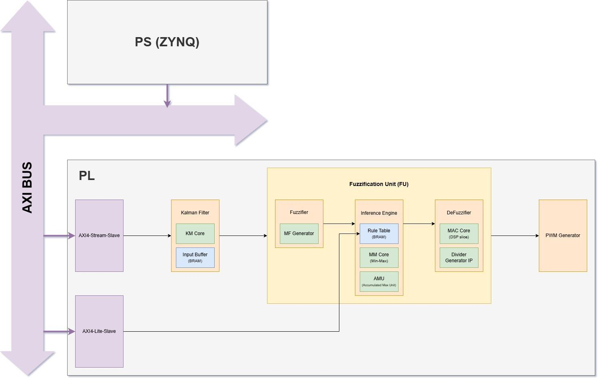
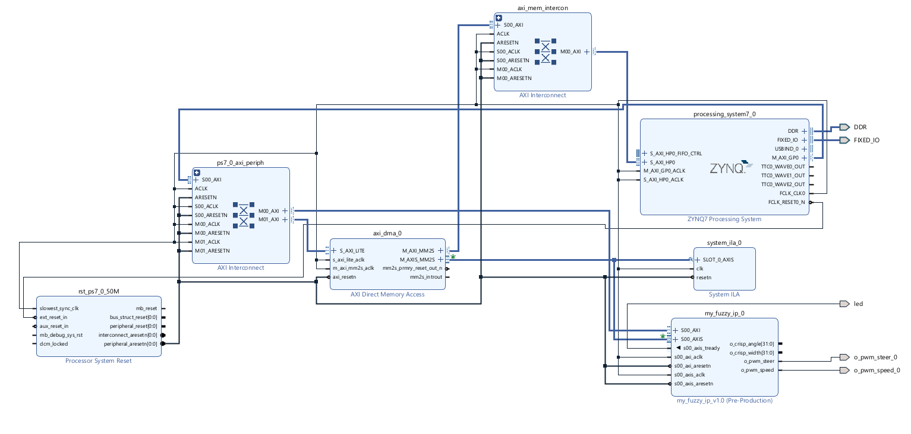

# 시스템 설계

## 인식 결과를 제어 입력으로 변환

Jetson은 검출 대상의 좌우 경계를 영상 너비로 나누어 `x_left`, `x_right`를 만들고, bounding box 면적을 전체 영상 면적으로 나누어 `size`를 계산합니다. 각 값의 범위는 0~1입니다.

PS의 기본 화각 설정은 55°입니다.

```text
center = (x_left + x_right) / 2
yaw_deg = (center - 0.5) * HFOV
angle_input = yaw_deg * 1000 / (HFOV / 2)
width_input = size * 1000
```

각도 입력은 -1000~1000, 면적 입력은 0~1000으로 변환합니다. PS는 직전 샘플과 현재 yaw의 변화량도 계산해 세 번째 입력과 함께 전송합니다. 복구한 PL은 PS의 움직임 워드 대신 매 클럭의 각도 차이를 자체 계산합니다. 최종 펌웨어는 Slow 채널 중심의 소속함수 설정으로 각도와 면적에 따라 방향·범위를 제어합니다.

## PS 태스크와 하드웨어 전달

| 구성 | 처리 |
|---|---|
| UDP 수신 | datagram 수신, 실수 3개 파싱, 입력값 검사 |
| Queue | 수신한 제어 데이터를 계산 태스크에 전달 |
| 초기화 | 소속함수 9개, 규칙, Singleton 값을 AXI4-Lite로 기록 |
| Binary Semaphore | 초기화가 끝난 뒤 계산 태스크 시작 |
| 제어 | 좌표 정규화, 정수 입력 생성, DMA 송신, 결과 readback |
| 수신 timeout | 200ms 동안 새 입력이 없으면 `(0, 0, 0)` 전달 |

DMA 송신 데이터는 signed 32-bit 정수 세 개 `[angle, movement, width]`입니다. 총 12바이트를 MM2S 채널로 전송하고 전송 전 CPU 데이터 캐시를 flush합니다.

## PL 처리



1. **Fuzzification**: 사다리꼴 소속함수로 각 입력의 소속도를 계산합니다. 기울기를 설정값으로 받아 곱셈·시프트로 연산합니다.
2. **Rule evaluation**: 각도·움직임에 대한 10개 규칙과 면적에 대한 2개 규칙을 평가합니다.
3. **Aggregation**: 같은 출력 집합에 속하는 규칙의 강도를 Max Tree로 집계합니다.
4. **Defuzzification**: 소속도와 Singleton의 가중합을 계산하고 나눗셈 IP로 출력값을 구합니다.
5. **PWM**: 방향·범위 제어값을 50Hz 서보 PWM으로 바꿉니다.

`Kalman_Filter`와 `KM_Core`는 입력 안정화를 위한 별도 모듈로 제공합니다. 복구한 최상위 RTL의 입력은 스트림 수신부에서 퍼지 연산부로 직접 연결됩니다.

| 설정 | 값 |
|---|---|
| 각도 소속함수 | NB, NM, ZE, PM, PB |
| 움직임 소속함수 | Slow, Fast |
| 면적 소속함수 | Short, Long |
| 각도 Singleton | -50, -25, 0, 25, 50 |
| 범위 Singleton | 60, -70 |
| PWM 주기 | 20ms |
| PWM 펄스 범위 | 1~2ms, 중앙 1.5ms |

## AXI 구성



AXI4-Lite로 제어 파라미터를 설정하고, AXI4-Stream으로 연속 입력을 공급합니다. 소프트웨어에서 사용하는 주소는 BSP가 생성한 `xparameters.h`를 기준으로 합니다.

| 영역 | 주소 / offset |
|---|---|
| Fuzzy IP base | `0x43C00000` |
| AXI DMA base | `0x40400000` |
| 소속함수 | `0x000`, 함수별 간격 `0x18` |
| 각도 규칙 | `0x100` |
| 면적 규칙 | `0x128` |
| 각도 Singleton | `0x200` |
| 면적 Singleton | `0x214` |
| AXI-Lite 참조 입력 | `0x300`, `0x304`, `0x308` |
| 제어 | `0x30C` |
| 결과 읽기 | 각도 `0x00`, 범위 `0x04` |

빌드에 사용하는 XSA의 연결 상태와 통합 절차는 [hardware 안내](../hardware/README.md)에 정리했습니다.
