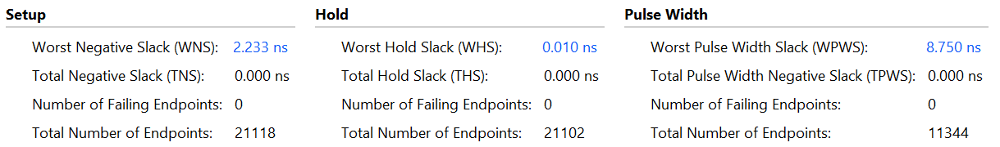
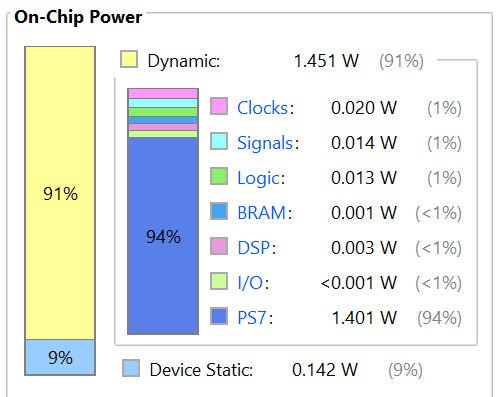

# 구현 결과

## 실물 시연

[시연 영상 보기](../media/adb-demo.mp4)

Logitech C270, Jetson Orin Nano, Zybo Z7-20, SG90 서보 2개를 연결해 제작한 차광 기구입니다. 어두운 실내에서 약 1~5m 거리의 사람을 대상으로 거리 변화와 횡이동에 따른 추적·차광 동작을 시연했습니다.

## 타이밍

Vivado 구현 결과입니다. PL 클럭은 50MHz이며 setup·hold failing endpoint는 모두 0입니다.

| 지표 | 값 |
|---|---:|
| Setup WNS | +2.233ns |
| Setup TNS | 0ns |
| Hold WHS | +0.010ns |
| Setup failing endpoints | 0 |
| Hold failing endpoints | 0 |

## 전력 추정

Vivado 전력 분석 결과입니다.

| 항목 | 추정값 |
|---|---:|
| Dynamic | 1.451W |
| Static | 0.142W |
| 합계 | 1.593W |

합계는 해당 설계의 on-chip power 추정값입니다. Jetson·서보·조명을 포함한 전체 장치의 소비전력은 이 표의 범위에 포함하지 않습니다.
